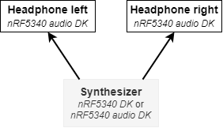

# Synthesize and transmit audio through BLE LE Audio with nRF5340
The new le audio specification brings improvements to Bluetooth audio. Lower latency and better perceived audio quality may make digital music instruments, utilizing Bluetooth audio, more appealing as commercial products. 

This demo application demonstrates a simple polyphonic synthesizer using *nRF5340 DK* or *nRF5340 Audio DK*. Synthesized audio is transmitted with le audio to receiving *nRF5340 Audio DK*s, which functions as the headset.

  

*Application is developed using nrf-sdk v2.0.2*

## Table of contents

1. [Useful resources](#useful-resources)
2. [System design](#system-design)
3. [Signal processing](#signal-processing)
4. [Programming and testing](#programming-and-testing)

## Useful resources

- [Teensy audio library for embedded](https://github.com/PaulStoffregen/Audio)
- [nRF5340 audio application](https://developer.nordicsemi.com/nRF_Connect_SDK/doc/latest/nrf/applications/nrf5340_audio/README.html)

## System design

The application is based on the Nordic [nrf5340_audio](https://developer.nordicsemi.com/nRF_Connect_SDK/doc/latest/nrf/applications/nrf5340_audio/README.html) demo application, but stripped down and specialized for a synthesizer use case. 

The diagram below illustrates the general audio synthesis flow.

  

The synthesizer is highly modular which makes it easy to include or exclude modules. The provided setup is constructed to demonstrate different aspects of a synthesizer, such as polyphonic oscillators, effects and audio-synced time-dependency.

The synthesizer module receives information on which notes to play and to stop playing. These notes may be transformed to create a sequencer, or in this case an arpeggiator. The arpeggiator is time-dependent, and thus needs a source of time. We must use a source of time which is synchronized with the sense of time in the processed audio. This is the function of `tick_provider`, which increments time for each audio block processed. The tick provider sends ticks to subscribing modules. This is the same method MIDI uses to synchronize different audio sources, which makes it possible to implement MIDI synchronization. 

For polyphonic synthesis we need multiple oscillators, equal to the number of notes it should be possible to play at once. `key_assign` keeps track of currently active oscillators and assigns notes to oscillators in a *first-inactive* (the oscillator which has been inactive for the longest time) manner. If there are no inactive oscillators, it will assign the new note to the *first-active* (the oscillator which has been active for the longest time) oscillator. The application is by default configured to have 5 oscillators. Even when playing an arpeggiator with more than 5 notes, it is hard to notice the last-inactive note cutting off.

The application is configured to encode mono audio, in `audio_process_start`. All modules are also constructed as mono.  It isn't too hard to modify the application to instead process stereo audio. The echo effect, for example, may by converted to a stereo ping-pong delay effect. Before the echo effect, split the mono sound into left and right channel. Then input these channels to the echo effect. Make sure to set the `pcm_size` correctly in `sw_codec_encode` for stereo encoding.

## Signal processing

Audio is processed in blocks of `N` samples, initiated in `audio_process`. A timer ensures new blocks are processed in an interval to match audio sample rate. For further development, this should probably instead be directly synced together with the Bluetooth connection interval. May use [mpsl_radio_notification]([API documentation — nrfxlib 2.2.99 documentation (nordicsemi.com)](https://developer.nordicsemi.com/nRF_Connect_SDK/doc/latest/nrfxlib/mpsl/doc/api.html#c.mpsl_radio_notification_cfg_set)).

Using a bit depth of 16-bit. The DSP is mainly done using integers in a fixed point format. Thus a type `fixed16` is defined with associated manipulations in `interger_math`. Since the applications is specifically targeted towards the nRF5340, the applications uses included DSP instructions in the SoC in some cases, abstracted by `dsp_instruction`.

With the current application configuration, about 80% of the *nRF5340* app core is used when all oscillators are active. Around 40% of the app core is used when two headset devices are connected. A large chunk of this is probably the LC3 encoder.

### Latency

The minimum connection interval in Bluetooth Low Energy is 7.5ms. Audio processing is initiated every 7.5ms to match the connection interval. The processing should thus not result in added latency. The new LC3 codec in LE audio, which replaces the SBC codex, is supposed to have much less latency. But this has not been tested in this particular application. The input buttons is configured with a 50ms debounce time. However this does not contribute to latency. This is because the implementation is such that the button state is assumed to change state whenever a new interrupt is triggered. After the debounce time, this assumption is tested by reading the pin value. This will result in occasional wrong button states, but corrected again after the debounce time. This has not resulted in any audible artifacts from tests.

## Programming and testing
*Minimum hardware requirements:*
- 1 *nRF5340 DK*
- 1 *nRF5340 audio DK* \
or
- 2 *nRF5340 audio DK*

It is recommended to use 2 *nRF5340 audio DK*s together with 1 *nRF5340 DK*.

### Programming
There is provided prebuilt binaries which works out of the box. It is recommended to program these binaries with the included `program.py` script. Run `python program.py -h` to see available options. It is recommended to verify that you are able to get the prebuilt binaries to work before building and programming from source yourself. You should program both the synthesizer board as well as the headset boards. Example of using `program.py`:

Programming synthesizer board
> python program.py --snr 1234567890 --device synth --board nrf5340_dk

Programming left headset board, snr is inferred if only one device is connected. If not, you will be promted to select from a list
> python program.py --device left

#### Building and program yourself
The application is developed using `nrf-sdk v2.0.2`. `common_net.hex` is borrowed from the `nrf5340_audio` application provided with this version of nrf-sdk, located in `bin/ble5-ctr-rpmsg_3251.hex`. The headsets has to be programmed with this audio application version to function correctly. The provided headset binaries are build from the stock `nrf5340_audio` application with added configs `CONFIG_AUDIO_HEADSET_CHANNEL_COMPILE_TIME=y` and `CONFIG_AUDIO_HEADSET_CHANNEL=x`, where x=0 => left headset, x=1 => right headset.

It is recomended to build and program the synth application through VS Code with the nrf Connect extension. Select the board you want to build for. Add `overlay-debug.conf` to your kconfig build configuration.

   

The application uses the LC3 codec which is included with `sdk-nrfxlib`. Make sure its up to date (inside west workspace by *nRF Connect: Create Shell Terminal* in VS Code *Command Palette*):

`west update`

The application should now be ready to build through the *Build* action in the `nRF Connect for VS Code` extension.

### Testing
Turn on both the synthesizer board as well as 1 or 2 headset boards. If `LED1`(blue) lights up on the headset board, there is a connection. By pressing the `PLAY/PAUSE` button on the headset board, audio output is enabled (the blue light should flash). Connect speaker to the headphone aux connection on the headset. Pressing `Button 1` to `Button 4` on the synthesizer board should now result in audio from headset boards.

Image below illustrates a possible setup with *nRF5340 DK* as synth.

  

## Further improvements

- remove `SBC` codec from application, since not used => remove `CONFIG_SW_CODEC_SBC` and `CONFIG_SW_CODEC_LC3`
- simplify and combine `ble_ack` files and `ble_connection`
- stereo processing
- remove `CONFIG_AUDIO_BIT_DEPTH_OCTETS` since application only supports 16-bit processing anyway
- synchronize audio processing with Bluetooth transmission
- update to latest nrf-sdk version and latest le audio net core, currently supports v2.0.2
