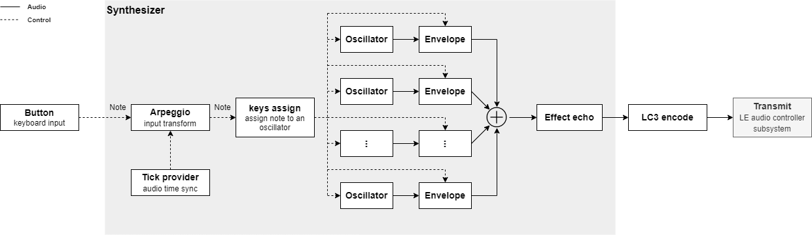

# Synthesize and transmit audio on the nrf5340 through le audio
The new le audio specification brings improvements to Bluetooth audio. Lower latency and better percieved audio quality may make digital music instruments, utilizing bluetooth audio, more appealing as commercial products. 

This demo application demonstrates a simple polyphonic synthesizer using the nRF5340 Audio DK. The buttons on the device functions as a simple piano keyboard. The synthesized audio is sendt through le audio to a recieving nRF5340 Audio DK, which functions as the recieving part such as an headset.

## Table of contents
1. [System design](#system-design)
2. [Signal processing](#signal-procesing)
3. [Programming](#programming)

## System design
The application is based on the nordic [nrf5340_audio](https://developer.nordicsemi.com/nRF_Connect_SDK/doc/latest/nrf/applications/nrf5340_audio/README.html) demo application, but stripped down and specialized for a synthesizer use 
case. 

The diagram below illustrates the general synthesizer flow.

# Signal procesing

## Programming
There is provided prebuilt binaries which works out of the box. It is recomended to program these binaries with the included `program.py` script. Run `python program.py -h` to see available options. It is recomended to verify that you are able to get the prebuilt binaries to work before building and programming from source yourself. Example of using `program.py`:

> python program.py --snr 1234567890 --device synth --board nrf5340_dk

> python program.py --snr 0987654321 --device left

### Building and programming youself
The application is developed using `nrf-sdk v2.0.2`. `common_net.hex` is borrowed from the `nrf5340_audio` application provided with this version of nrf-sdk, located in `bin/ble5-ctr-rpmsg_3251.hex`. The headsets has to be programmed with this audio application version to function correctly. The provided headset binaries are build from the stock `nrf5340_audio` application with added configs `CONFIG_AUDIO_HEADSET_CHANNEL_COMPILE_TIME=y` and `CONFIG_AUDIO_HEADSET_CHANNEL=x`, where x=0 => left headset, x=1 => right headset.

It is recomended to build and program the synth application through VS Code with the nrf Connect extension. Select the board you want to build for. Add `overlay-debug.conf` to your kconfig build configuration.\

The application uses the LC3 codec (closed source). Make sure to include it through west:

`west config manifest.group-filter +nrf5340_audio`

`west update`

The application should now be ready to build through the build action in the nrf connect vs code extension.
